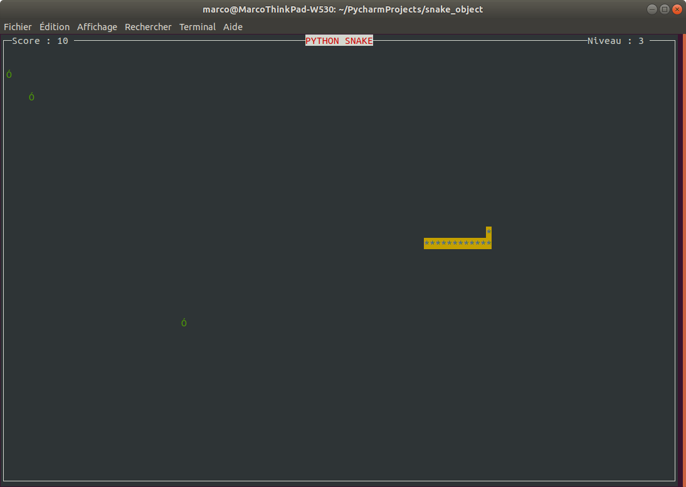

# PythonSnake

>Le snake, de l’anglais signifiant « serpent », est un genre de jeu vidéo dans lequel le joueur dirige une ligne qui grandit et constitue ainsi elle-même un obstacle. Bien que le concept tire son origine du jeu vidéo d’arcade Blockade développé et édité par Gremlin Industries en 1976, il n’existe pas de version standard. Son concept simple l’a amené à être porté sur l’ensemble des plates-formes de jeu existantes sous des noms de clone.
>
>Le joueur contrôle une longue et fine ligne semblable à un serpent, qui doit slalomer entre les bords de l’écran et les obstacles qui parsèment le niveau. Pour gagner chacun des niveaux, le joueur doit faire manger à son serpent un certain nombre de pastilles similaire à de la nourriture, allongeant à chaque fois la taille du serpent. Alors que le serpent avance inexorablement, le joueur ne peut que lui indiquer une direction à suivre (en haut, en bas, à gauche, à droite) afin d’éviter que la tête du serpent ne touche les murs ou son propre corps, auquel cas il risque de mourir.
> wikipedia https://fr.wikipedia.org/wiki/Snake_(genre_de_jeu_vid%C3%A9o) 

## Le jeu

Dans notre version, le lancement du jeu devra :

* Afficher une bannière contenant le nom du jeu PYTHON SNAKE pendant 2 secondes avant d’afficher l’aire de jeu
* Afficher l’aire de jeu avec le score et le niveau
* L’aire de jeu contient un serpent et au moins une pomme.
* Le serpent se déplace dans l’aire de jeu.
* Il réapparait sur le bord opposé lorsqu’il sort de l’aire de jeu.
* Il grandit d’un anneau chaque fois qu’il mange une pomme.
* A chaque niveau, il doit manger 5 pommes.
* Au premier niveau, l"aire de jeu contient 1 pomme à la fois, ausecond niveau, 2 pommes, 3 au troisième, ….
* La vitesse de déplacement du serpent augmente à chaque niveau.
* Le jeu prend fin lorsque le joueur appui sur la touche Echap ou lorsque le serpent se mord la queue

